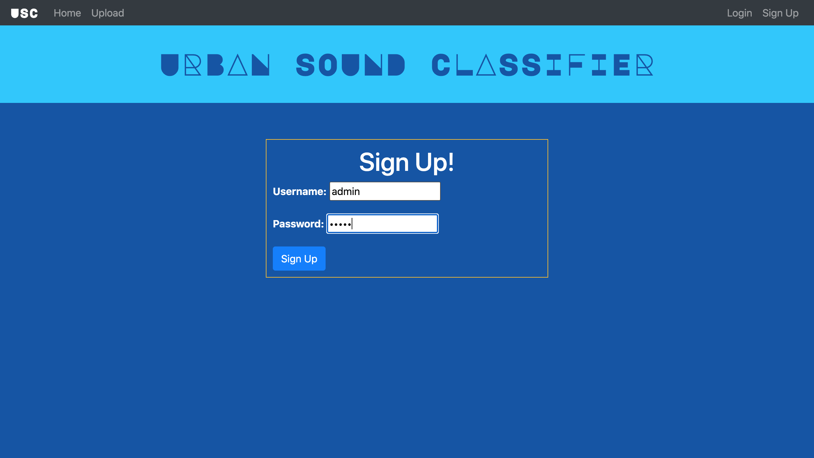

# Urban-Sound-Classification-Webapp
Web app for urban sound classification

## Install Dependancies

- Download npm on your device
- run :  <code>npm install</code>  on your terminal

## Steps to set-up network:

- Run command  :  ``docker-compose up``  on your terminal
- open :  ``localhost:3000`` on your browser

## Screens

### Landing Page

  

### Sound Board

- Global sound board for sounds published by all users
  

### Upload Screen

  

### Classification Result

- Can define visibility of sound clip
  

### User Page

  

### Sign-up and Log-in pages

  

